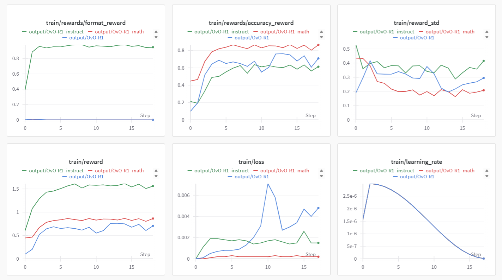
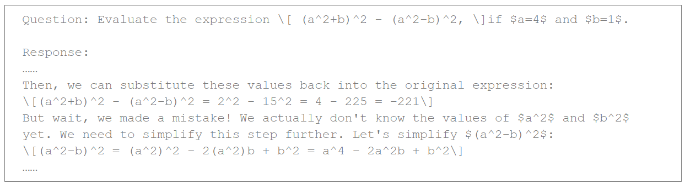
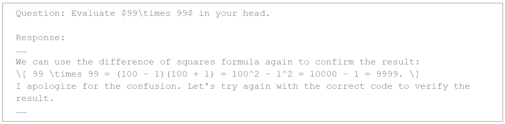
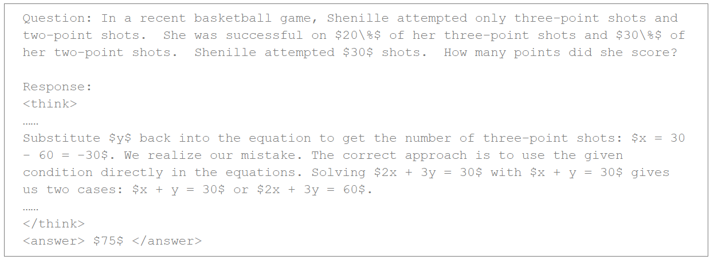

# OvO-R1
The purpose of OvO-R1 is to explore the influence of using end-to-end reinforcement learning and various reward functions on the reasoning capabilities of different base models (Qwen2.5-1.5B/Qwen2.5-1.5B-Math/Qwen2.5-1.5B-Instruct).

## Feature

- Qwen2.5-1.5B/Qwen2.5-1.5B-Math/Qwen2.5-1.5B-Instruct scale model RL training
- We supply 0.75k dataset for fast train loop, more experiments on large scale datasets is around the corner
- We release wandb log for comparison between difference base models using GRPO
- We are exploring the impact of various reward functions on these models

## Installation

```bash
conda create -n ovo_r1 python=3.11
conda activate ovo_r1
```

and

```bash
pip install -r requirements.txt
```

## Results

| Model                 | OvO-R1                                                  | OvO-R1-Math                                             | OvO-R1-Instruct                                         |
| --------------------- | ------------------------------------------------------------ | ------------------------------------------------------------ | ------------------------------------------------------------ |
| Base Model            | Qwen2.5-1.5B | Qwen2.5-1.5B-Math | Qwen2.5-1.5B-Instruct |
| GPU                   | 4x3090                                                       | 4x3090                                                       | 4x3090                                                       |
| Dataset_mini               | [X-R1-750](https://huggingface.co/datasets/xiaodongguaAIGC/X-R1-750)                             | [X-R1-750](https://huggingface.co/datasets/xiaodongguaAIGC/X-R1-750)                              | [X-R1-750](https://huggingface.co/datasets/xiaodongguaAIGC/X-R1-750)                              |
| Dataset_middle               | - | -                                                  | -                                                 |
| Dataset_large               | - | -                                                  | -                                                 |
| Config: recipes       | OvO_R1_config.yaml                                 | OvO_R1_math_config.yaml                                 | OvO_R1_instruct_config.yaml                                     |
| num_generations       | 8                                                           | 8                                                            | 8                                                            |
| max_completion_length | 1024                                                         | 1024                                                         | 1024                                                         |
| num_train_epochs      | 3                                                            | 3                                                            | 3                                                            |

## Wandb Log



## Aha Moment

### OvO_r1



### OvO_r1_math



### OvO_r1_instruct



## Training

To train the proposed method, run the following commands:

### OvO_r1

```
ACCELERATE_LOG_LEVEL=info accelerate launch --config_file recipes/zero3.yaml --num_processes=3 src/ovo_r1/grpo.py --config recipes/OvO_R1_config.yaml > ./output/ovo_r1.log
```

### OvO_r1_math

```
ACCELERATE_LOG_LEVEL=info accelerate launch --config_file recipes/zero3.yaml --num_processes=3 src/ovo_r1/grpo.py --config recipes/OvO_R1_math_config.yaml > ./output/ovo_r1_math.log
```

### OvO_r1_instruct

```
ACCELERATE_LOG_LEVEL=info accelerate launch --config_file recipes/zero3.yaml --num_processes=3 src/ovo_r1/grpo.py --config recipes/OvO_R1_instruct_config.yaml > ./output/ovo_r1_instruct.log
```

## Contact

Our email is xuzhaoli2001@gmail.com and xuchenli1030@gmail.com

Any discussions and suggestions are welcome!

## Acknowledge

Thanks for [Open-R1](https://github.com/huggingface/open-r1), [TRL](https://github.com/huggingface/trl), [X-R1](https://github.com/dhcode-cpp/X-R1)!
